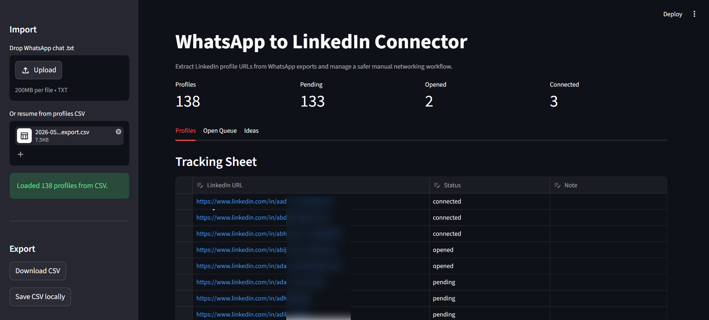
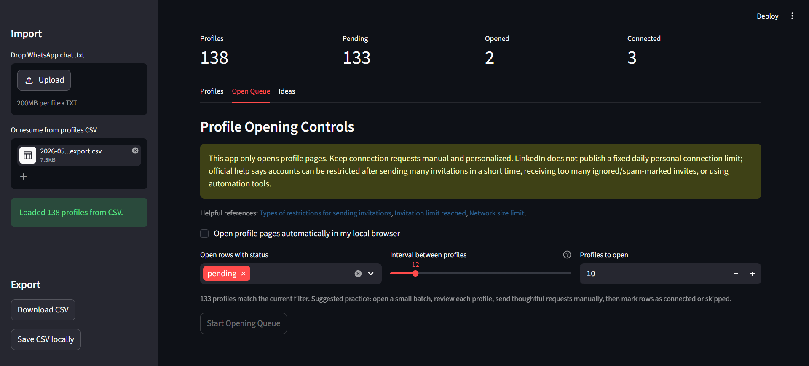
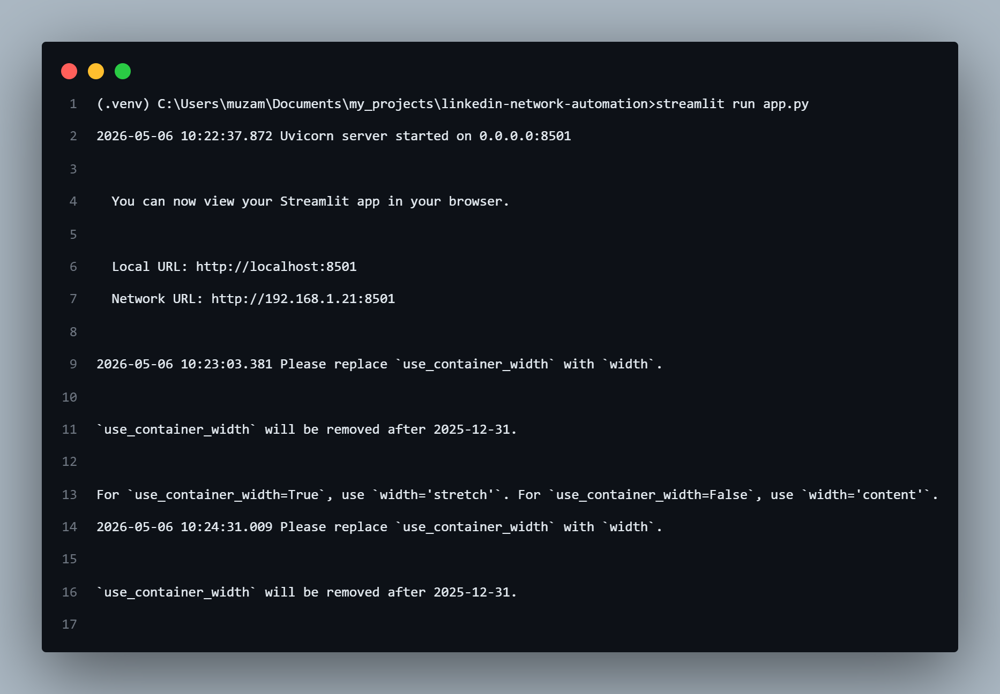

# WhatsApp-to-LinkedIn Connector Automation

A lightweight Python automation tool that helps extract LinkedIn profile URLs shared inside WhatsApp groups and streamline the networking workflow.

Built for situations where dozens of people share their LinkedIn profiles in communities, startup groups, AI circles, hackathons, or event groups, making manual searching and connecting repetitive and time-consuming.

---

## 📸 Screenshots

### Main Tracking Dashboard



### Batch Opening Controls



### CLI Usage



## Problem

In active WhatsApp communities, many members share their LinkedIn profile URLs during introductions.

Manually:

* searching each profile
* opening links
* tracking who you connected with
* avoiding duplicates

becomes messy and inefficient.

Especially in:

* AI communities
* startup groups
* hackathons
* networking events
* tech meetups

---

## Solution

This project automates the repetitive parts of the workflow using Python.

The tool:

* extracts LinkedIn profile URLs from exported WhatsApp chats
* removes duplicates
* stores profiles in CSV format
* offers a Streamlit GUI for drag-and-drop chat imports
* opens selected profiles in browser batches with manual safety controls

### Manual steps intentionally kept manual

For platform safety and account protection:

* WhatsApp chat export → Manual
* Sending LinkedIn connection requests → Manual

This avoids violating platform automation policies and keeps networking personalized.

---

## Features

* Extract LinkedIn profile URLs from WhatsApp exported `.txt` chat
* Normalize and deduplicate repeated URLs
* Generate clean CSV tracking sheet
* Auto-open pending profiles sequentially in browser
* Limit each opening session and configure delay between profiles
* Update opened profiles from `pending` to `opened`
* Dry-run mode for previewing links before opening the browser
* Lightweight and beginner-friendly
* No APIs required
* No browser automation frameworks required

---

## Tech Stack

* Python 3
* Regex (`re`)
* CSV handling
* Webbrowser module
* Streamlit
* Pandas

---

## Workflow

```text
WhatsApp Group
      ↓
Export Chat (.txt)
      ↓
Python URL Extractor
      ↓
linkedin_profiles.csv
      ↓
Auto-open LinkedIn Profiles
      ↓
Manual Personalized Connect Requests
```

---

## Project Structure

```bash
linkedin-network-automation/
│
├── extract_links.py
├── open_profiles.py
├── app.py
├── requirements.txt
├── linkedin_profiles.csv      # generated, ignored by Git
├── README.md
└── sample_chat.example.txt    # optional sample input
```

---

## Installation

Clone the repository:

```bash
git clone https://github.com/yourusername/linkedin-network-automation.git

cd linkedin-network-automation
```

Install dependencies for the Streamlit GUI:

```bash
pip install -r requirements.txt
```

---

## Usage

### Option A: Streamlit GUI

Run:

```bash
streamlit run app.py
```

The GUI supports:

* drag-and-drop WhatsApp `.txt` chat export
* upload an existing `linkedin_profiles.csv` to resume tracking
* editable status and note columns
* CSV download
* local CSV save
* filtered browser opening by status
* interval and profile-count controls
* safety warning before opening profiles automatically

Important: the app only opens profile pages. Sending LinkedIn connection requests stays manual and personalized.

LinkedIn does not publish a fixed daily personal connection limit. Their help pages say accounts can be restricted after sending many invitations in a short time, receiving too many ignored or spam-marked invites, or using automation tools. Basic/free members also have a limited number of personalized connection messages per month.

Suggested usage:

```text
Open 5-10 profiles per session
Use 10-20 seconds between profile opens
Send connection requests manually
Mark rows as connected, skipped, or follow-up in the CSV
```

### Option B: CLI

### Step 1: Export WhatsApp Chat

From WhatsApp:

```text
Group → More → Export Chat → Without Media
```

Place the exported `.txt` file inside the project folder, or pass its full path to the extractor.

---

### Step 2: Extract LinkedIn URLs

Run:

```bash
python extract_links.py WhatsAppChat.txt
```

To choose a custom output file:

```bash
python extract_links.py WhatsAppChat.txt --output linkedin_profiles.csv
```

Output:

```text
linkedin_profiles.csv
```

---

### Step 3: Open Profiles Automatically

Run:

```bash
python open_profiles.py
```

The script opens `pending` LinkedIn profiles one by one in your browser and marks opened rows as `opened`.

Useful options:

```bash
python open_profiles.py --limit 10 --delay 8
python open_profiles.py --csv linkedin_profiles.csv --limit 5
python open_profiles.py --dry-run
```

You manually:

* review profile
* personalize note
* send request
* optionally update the CSV status to `connected` or `skipped`

### CSV Status Values

The generated CSV includes:

```csv
linkedin_url,status,note
```

Recommended status values:

* `pending` → not opened yet
* `opened` → opened in browser
* `connected` → connection request sent manually
* `skipped` → intentionally ignored

---

## GUI Feature Branch Ideas

Useful ideas for the `gui-streamlit` branch:

* Batch presets for light networking, event follow-up, and deep review sessions
* Duplicate insights showing repeated links and where they appeared in the chat
* CSV merge to combine new chat exports with an older tracking sheet
* Daily session log to count opened profiles per day
* Search and filters by status, notes, and profile slug
* One-profile-at-a-time review mode with a Next button
* Personalized note draft templates based on manually entered context
* Follow-up statuses such as `replied`, `follow_up`, and `not_relevant`

---

## Example Use Cases

* AI communities
* Startup founder groups
* Tech networking events
* Hackathon communities
* College alumni groups
* Developer communities

---

## Why I Built This

I often join AI and startup communities where people introduce themselves by sharing LinkedIn profile URLs.

After seeing dozens of profiles shared inside WhatsApp groups, I wanted a faster workflow to:

* discover builders
* connect with founders
* expand my professional network
* reduce repetitive manual effort

So I vibe-coded this lightweight automation tool using Python.

---

## Future Improvements

* GUI with Streamlit ✅
* Auto-tagging profiles by role/company
* CRM-style connection tracker
* AI-generated personalized connection notes
* Chrome extension integration
* Google Sheets sync

---

## Disclaimer

This project does NOT automate:

* LinkedIn login
* Sending connection requests
* WhatsApp scraping

Users should follow LinkedIn’s platform policies and send personalized connection requests responsibly.

---

## Author

**Muzammil Ibrahim P M**
Application Developer Intern @ IBM CIC Bangalore
Tech Enthusiast | Automation Builder | AI & Product Curious

GitHub: `github.com/muzammil-13`
